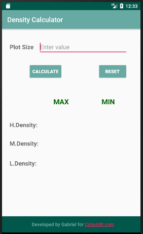

# The-Density-Calculator-Mobile-App
This app is used to calculate the density of a plot before determining the type of development that goes there

The User Interface

First Page before editing

  

The Result

  
